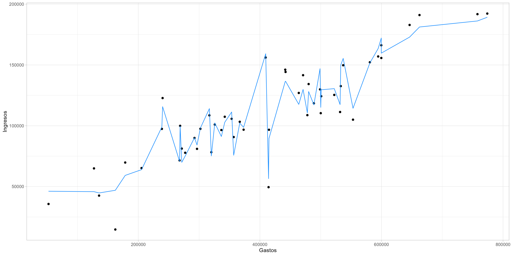
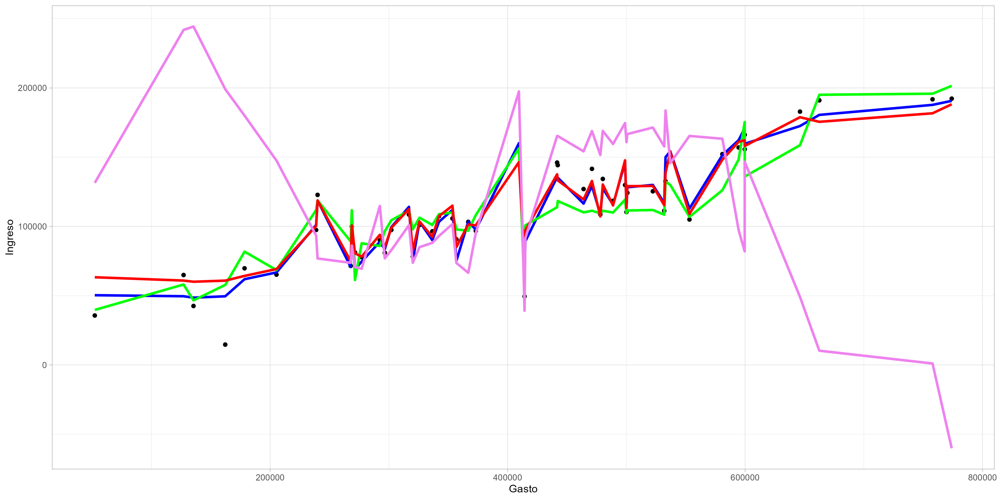

## "Polinomial_SRV"
A partir de modelos de diferentes grados obtenemos el necesario para ajustarlo
a las necesidades que tenemos al encontrar uno que se ajuste a los valores, la
forma realizada es la siguiente:
```
#Grado 1
modelo.lin <- lm(formula = Profit ~ (R.D.Spend + Administration + Marketing.Spend),
                 data = datos)
summary(modelo.lin)
grfico.1.modlin <- geom_line(aes(x = (datos$Marketing.Spend+datos$Administration+datos$R.D.Spend),
                                 y = predict(modelo.lin,
                                             newdata = datos)),
                             colour = "red")
```
En este caso se optó por elegir el modelo 20, ya que es el que toca puntos de una manera en la
que ninguno queda ni muy cercano ni tan lejano, eso ayuda a saber que el modelo seleccionado
es válido ya que tiene mas precision.
```
#Grado 20
modelo.lin20 <- lm(formula = Profit ~ poly((R.D.Spend + Administration + Marketing.Spend), 20),
                  data = datos)
summary(modelo.lin20)
grfico.20.modlin <- geom_line(aes(x = (datos$Marketing.Spend+datos$Administration+datos$R.D.Spend),
                                 y = predict(modelo.lin20,
                                             newdata = datos)),
                             colour = "violet")
```
Y se puede representar de la siguiete manera el conjunto de modelos utilizados:

## SUPPORT VECTOR REGRESSION (SVR)
El formulado para estas regreciones no es complicado de programar aquí en R, ya que se formula así:
```
svr.lin <- svm(formula = Profit ~ .,
               data = datos,
               kernel = "linear",
               type = "eps-regression")
summary(svr.lin)
```
En donde lo que se cambia es el **_"Kernel"_ ** el cual es la función que permite agrupar un conjunto
de datos que ayuda a distribuir la densidad de los mismos usando una estimación  de Densiada de Kernel,
esto nos permie ver los datos de una manera mas fluida dentro de la gráfica para evitar bosquejos poco
legibles o dificiles de analizar, en este caso usando un Kernel de tipo polinomial, una comparación:
```
```
## Sin Kernel

```
```
## Con kernel

```
```
## Conclusión
El uso de herramientas tan poderosas como RStudio ayuda mucho a la gente que se dedica a analizar datos
usando todos estos métodos de una forma casi instantánea, ya que la velocidad con la que se trabaja
es demasiado eficaz, además, los métodos de uso no son tan complicados de analiar cuando se sabe lo que
realmente se requiere, el problema verdadero es saber con qué información se desea o necesita trabajar,
ya que esta herramienta ofrece el análisis de enormes cantidades de valores de manera simultánea, sin
mencionar la excelente respuesta que tiene sobre la creación de gráficos de todo tipo para representar
de mejor forma visual la información que se está manejando al momento.